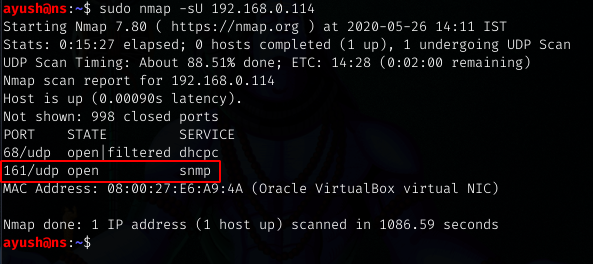
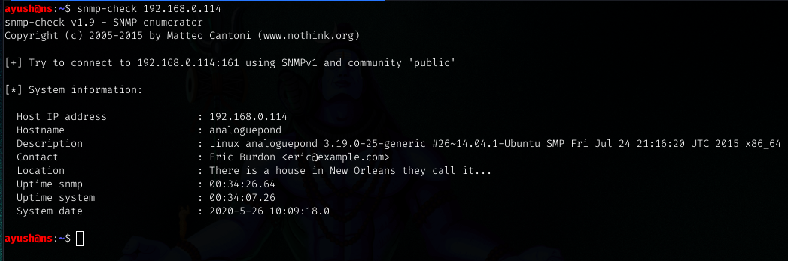
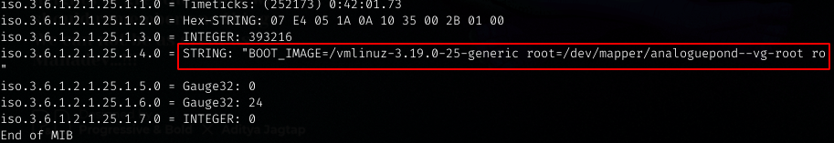
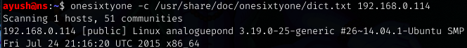

# **SNMP ENUMERATION**

## What is SNMP?
**Simple Network Management Protocol (SNMP)** is an Internet Standard protocol for collecting and organizing information about managed devices on IP networks and for modifying that information to change device behavior. Devices that typically support SNMP include cable modems, routers, switches, servers, workstations, printers, and more.

SNMP is widely used in network management for network monitoring. SNMP exposes management data in the form of variables on the managed systems organized in a management information base (MIB) which describe the system status and configuration. These variables can then be remotely queried (and, in some circumstances, manipulated) by managing applications.
-Wikipedia

## How SNMP works?
SNMP works by sending messages, called protocol data units (PDUs), to devices within your network that “speak” SNMP. These messages are called SNMP Get-Requests. Using these requests, network administrators can track virtually any data values they specify. All of the information SNMP tracks can be provided to a product that asks for it. That product can either display or store the data, depending on an administrator’s preferences.

### MIB and OID 
MIB stands for Management Information Base. An MIB is a collection of Information for managing network element.
The MIBs comprise of managed objects identified by something known as Object Identifier (OID). OID consists of a series of numbers or strings separated by dots.

## SNMP Enumeration
The SNMP protocol is a stateless, datagram oriented protocol. SNMP works on Port 161.


**Nmap Scripts**


**Snmp-check** 
snmp-check allows you to enumerate the SNMP devices and places the output in a very human readable friendly format.
```
ayush@ns:~$ snmp-check -h
snmp-check v1.9 - SNMP enumerator
Copyright (c) 2005-2015 by Matteo Cantoni (www.nothink.org)

 Usage: snmp-check [OPTIONS] <target IP address>

  -p --port        : SNMP port. Default port is 161;
  -c --community   : SNMP community. Default is public;
  -v --version     : SNMP version (1,2c). Default is 1;

  -w --write       : detect write access (separate action by enumeration);

  -d --disable_tcp : disable TCP connections enumeration!
  -t --timeout     : timeout in seconds. Default is 5;
  -r --retries     : request retries. Default is 1; 
  -i --info        : show script version;
  -h --help        : show help menu;
```


**snmpwalk**
snmpwalk is an SNMP application that uses SNMP GETNEXT requests to query a network entity for a tree of information.




**onesixtyone**
Onesixtyone is an SNMP analysis tool that is named for the UDP port upon which SNMP operates. It is a very simple SNMP scanner that only requests the system description value for any specified IP address(es).


### Metasploit scanner SNMP auxiliary modules

**SNMP_ENUM**
The snmp_enum module performs detailed enumeration of a host or range of hosts via SNMP similar to the standalone tools snmpenum and snmpcheck.


**SNMP_ENUMSHARES**
The snmp_enumshares module is a simple scanner that will query a range of hosts via SNMP to determine any available shares.

**SNMP_ENUMUSERS**
The snmp_enumusers module queries a range of hosts via SNMP and gathers a list of usernames on the remote system.

**SNMP_LOGIN**
The snmp_login scanner is a module that scans a range of IP addresses to determine the community string for SNMP-enabled devices.
