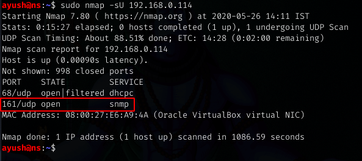
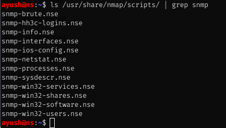
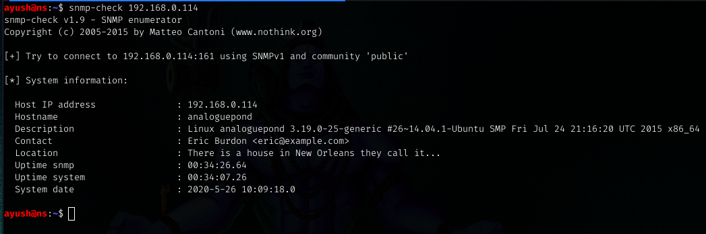
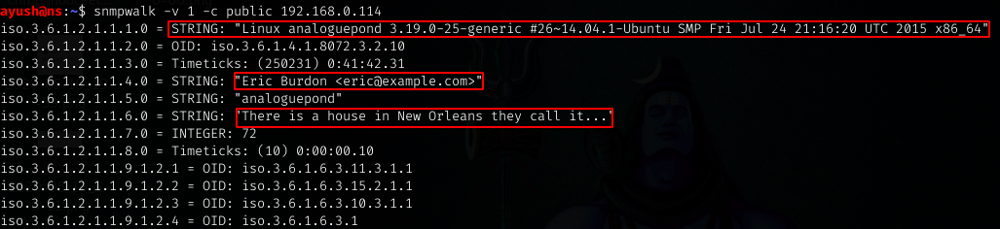
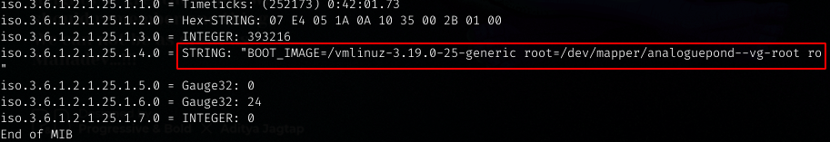
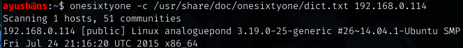

# **SNMP ENUMERATION**

## What is SNMP?
**Simple Network Management Protocol (SNMP)** is an Internet Standard protocol for collecting and organizing information about managed devices on IP networks and for modifying that information to change device behavior. Devices that typically support SNMP include cable modems, routers, switches, servers, workstations, printers, and more.

SNMP is widely used in network management for network monitoring. SNMP exposes management data in the form of variables on the managed systems organized in a management information base (MIB) which describe the system status and configuration. These variables can then be remotely queried (and, in some circumstances, manipulated) by managing applications.
-Wikipedia

## How SNMP works?
SNMP works by sending messages, called protocol data units (PDUs), to devices within your network that “speak” SNMP. These messages are called SNMP Get-Requests. Using these requests, network administrators can track virtually any data values they specify. All of the information SNMP tracks can be provided to a product that asks for it. That product can either display or store the data, depending on an administrator’s preferences.

### MIB and OID 
MIB stands for Management Information Base. An MIB is a collection of Information for managing network element.
The MIBs comprise of managed objects identified by something known as Object Identifier (OID). OID consists of a series of numbers or strings separated by dots.

## SNMP Enumeration
SNMP works on Port 161 on a UDP protocol.

**Nmap Scripts**

**Snmp-check**

**snmpwalk**

**onesixtyone**

